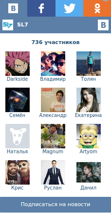

# Социальные аккаунты

Блок с виджетами групп и сообществ в социальных сетях. Можно подключать свои стили.

**Скриншоты в конце описания**

* Несколько групп в одном блоке
* Переключение групп на лету (Ajax)
* Выбор вкладки "по умолчанию"
* Вконтакте
* Facebook
* Одноклассники
* Twitter

Требуемые модули от SL7:
* [sl7_control_panel](https://github.com/SemyonDragunov/sl7_control_panel)

Для Drupal 7.

Автор: Семён Драгунов [sam.dragunov@gmail.com](sam.dragunov@gmail.com)

Apache License 2.0

Если необходима английская версия модуля, пишите автору.

***
# Social button (accounts)

Block with widgets of groups and communities in social networks.

**Screenshots at the end of the this description**

* Multiple groups in one block
* Switching groups on the fly (Ajax)
* Selecting the "default" tab
* In contact with
* Facebook
* Odnoklassniki
* Twitter

Required modules from SL7:
* [sl7_control_panel](https://github.com/SemyonDragunov/sl7_control_panel)

For Drupal 7.

Author: Semyon Dragunov [sam.dragunov@gmail.com](sam.dragunov@gmail.com)

Apache License 2.0

If you need an English version of the module, write to author.

***
